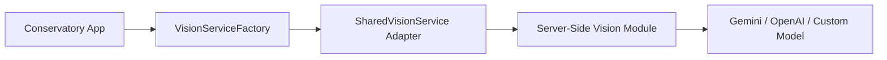

# 🦅 VISION SERVICE AGNOSTIC ROADMAP

**Objective**: Decouple the vision identification logic from the Conservatory app, moving it to a modular, server-side "Vision Service" that can be shared across multiple projects (Aquaculture, Botany, etc.).

---

## 1. ARCHITECTURAL VISION

The Conservatory should not care *how* a photo is identified. It should only care that it receives biological data.



### Key Goals:
- **Zero App-Specific Logic in Server**: The server-side module returns raw biological data; the app's adapter maps it to internal types.
- **Pluggable Models**: Easily swap between Gemini Pro, GPT-4o, or specialized biological models without changing app code.
- **Multimodal Ready**: Support for single species ID and complex "Rack Scene" analysis.

---

## 2. THE UNIVERSAL VISION API SPEC (Draft)

To make the server-side module modular, it will implement a "Biological Vision Protocol" (BVP).

### Endpoint 1: `POST /identify`
**Input**:
```json
{
  "image": "base64_string",
  "context": "aquatic_life" // Optional hint
}
```

**Output (Agnostic Schema)**:
```json
{
  "subject": {
    "scientific_name": "string",
    "common_name": "string",
    "classification": {
      "kingdom": "string",
      "family": "string"
    }
  },
  "confidence": 0.0 - 1.0,
  "analysis": "detailed reasoning string",
  "metadata": { "model": "gemini-pro-1.5", "latency_ms": 1200 }
}
```

---

## 3. IMPLEMENTATION PLAN

### Phase 1: Refactor Client Adapter (Conservatory App)
1.  **Update `SharedVisionService.ts`**:
    - Modify it to act as a **Transformer**.
    - It should call the new Universal API and map the response to the Conservatory's `IdentifyResult` type.
    - Add robust error handling for "Service Unavailable" fallbacks.

### Phase 2: Build the Server-Side Vision Module
1.  **Tech Stack**: Node.js/Express or Python/FastAPI.
2.  **Core Logic**: 
    - Receive image.
    - Forward to AI (Gemini Pro Vision/1.5).
    - Format response into the Universal Schema.
    - Add caching (Redis) for identical image hashes to save costs.
3.  **Multi-App Support**: Use API Keys to identify which app is calling (Conservatory, PlantTracker, etc.) and apply app-specific prompt tuning if needed.

### Phase 3: Switch & Verify
1.  **Environment Variables**: 
    - Set `VITE_SHARED_VISION_SERVICE_URL` to point to the new module.
2.  **Test Suite**: 
    - Mock the Vision Module response to verify the app handles the "agnostic" data correctly.

---

## 4. THE "UNSPOKEN" UPGRADES

*While building the agnostic service, we should implement these cross-app benefits:*

- **Cost Aggregation**: Centralized tracking of AI costs across all apps using the vision service.
- **Image Pre-processing**: The server-side module can resize/compress images before sending them to the AI to reduce latency and token usage.
- **Grounding Library**: The server can check the identification against a global biological database (GBIF/Wikipedia) before returning it to the app, ensuring higher precision.

---

## 5. NEXT STEPS FOR THE "NEXT AGENT"

1.  **Create the Server Repository**: Initialize a standalone Node.js service for the Vision Module.
2.  **Copy Prompts**: Port the vision prompts from `geminiService.ts` in the Conservatory project to the new server.
3.  **Update Conservatory Factory**: Ensure the factory can handle multiple "Remote" tiers (e.g., `SharedVisionService` with a fallback to `GeminiVisionService`).

---
*Status: Roadmap Proposed. Awaiting "Build" command for Phase 1.*
