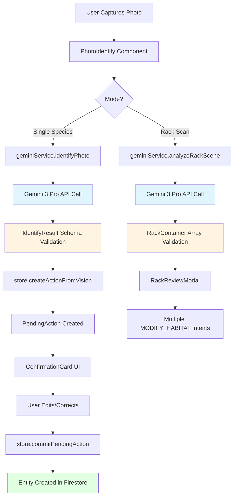
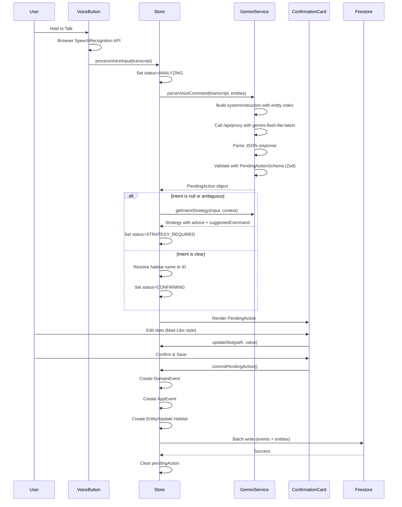
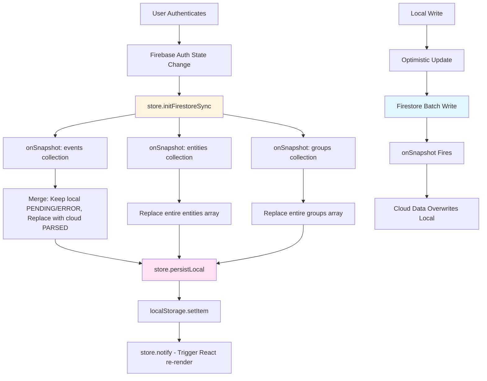
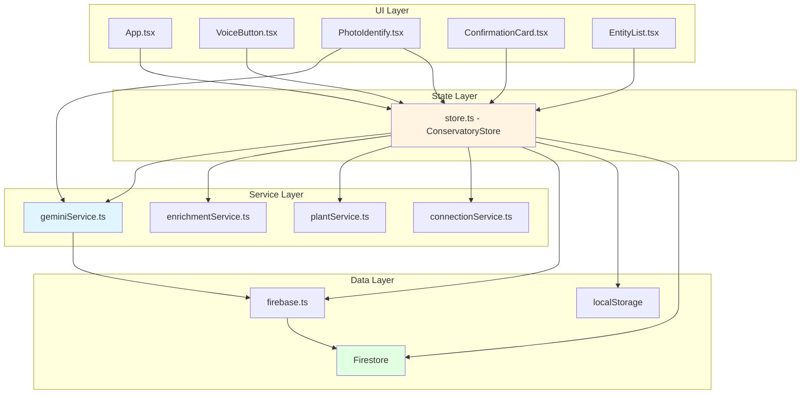

# PASS 1: Technical Analysis

This document contains the detailed technical analysis of The Conservatory codebase, including code flows, architecture patterns, and implementation details.

---

## 1. Reverse-Engineered Workflow Mapping

### 1.1 Image → AI → Structured Output Flow



**Key Observations**:
- **Direct-to-Store Pattern**: Photo identification bypasses voice processing entirely (`createActionFromVision`), creating `PendingAction` directly
- **Dual Mode Operation**: Single species ID vs. batch rack analysis use different AI endpoints but converge on same confirmation UI
- **Base64 Encoding**: Images are converted to base64 in browser, sent directly to AI proxy (no intermediate storage)
- **Optimistic Updates**: Entities created locally before Firestore commit for instant UI feedback

### 1.2 Voice Command → Intent Parsing → Confirmation → Commit Flow



**Key Observations**:
- **Two-Stage AI Processing**: Fast parser (flash-lite) for intent extraction, fallback to strategy agent for ambiguous input
- **Conversational Loop**: Strategy agent can be accepted/rejected, creating recursive `processVoiceInput` call
- **Entity Resolution**: Habitat names resolved to IDs using fuzzy matching against existing entities
- **Batch Writes**: All Firestore operations batched for atomicity
- **Test Mode Bypass**: `__TEST_MODE__` flag skips Firestore writes, uses `MockFirestoreService`

### 1.3 Enrichment Pipeline Flow

```mermaid
flowchart LR
    A[Entity Created] --> B[enrichment_status: queued]
    B --> C[User Triggers Deep Research]
    C --> D[store.enrichEntity]
    
    D --> E[Stage 1: Local Library]
    E --> F[plantService.search]
    F --> G{Found?}
    G -->|Yes| H[Merge: description, images, traits]
    G -->|No| I[Continue]
    
    I --> J[Stage 2: GBIF]
    J --> K[enrichmentService.searchGBIF]
    K --> L[Merge: taxonomy, scientificName]
    
    L --> M[Stage 3: Wikipedia]
    M --> N[enrichmentService.searchWikipedia]
    N --> O[Merge: description]
    
    O --> P[Stage 4: iNaturalist]
    P --> Q[enrichmentService.searchiNaturalist]
    Q --> R[Merge: commonName aliases, images]
    
    R --> S[Stage 5: AI Discovery]
    S --> T[geminiService.getBiologicalDiscovery]
    T --> U[Merge: mechanism, evolutionaryAdvantage, synergyNote]
    
    U --> V[Update Entity in Firestore]
    V --> W[enrichment_status: complete]
    
    style E fill:#e1f5ff
    style J fill:#e1f5ff
    style M fill:#e1f5ff
    style P fill:#e1f5ff
    style S fill:#e1f5ff
    style V fill:#e1ffe1
```



**Key Observations**:
- **Sequential Stages**: Enrichment runs serially (not parallel) with stage callbacks for progress tracking
- **Priority-Based Merging**: Local library data overrides external sources; GBIF taxonomy stored in `overflow.taxonomy`
- **Manual Trigger**: Enrichment does NOT auto-trigger on accession; must be manually invoked or batch-triggered via `deepResearchAll`
- **Non-Fatal Failures**: Each stage catches errors and continues; only final stage failure marks `enrichment_status: failed`

### 1.4 State Synchronization Flow



**Key Observations**:
- **Dual Persistence**: localStorage for offline + Firestore for cloud sync
- **Optimistic Updates**: Local state updated immediately, Firestore sync happens asynchronously
- **Race Condition Risk**: Local writes can be overwritten by stale cloud snapshots if timing is off
- **No Conflict Resolution**: Last-write-wins; no merge strategies for concurrent edits
- **Test Mode Isolation**: `__TEST_MODE__` prevents Firestore writes but still uses localStorage

---

## 2. Prompt Construction and Response Parsing Flow

### 2.1 Prompt Construction Patterns

**Voice Command Parsing** (`geminiService.parseVoiceCommand`):
```typescript
System Instruction Template:
"You are the Principal Curator of 'The Conservatory'. Parse user voice input into structured JSON.
Existing Index: ${JSON.stringify(entityIndex)}
Priority: Speed. Use gemini-flash-lite-latest."

User Input: Raw transcription string

Generation Config:
- model: "gemini-flash-lite-latest"
- responseMimeType: "application/json"
- responseSchema: PENDING_ACTION_SCHEMA (Google GenAI Type enum)
```

**Photo Identification** (`geminiService.identifyPhoto`):
```typescript
Multimodal Input:
- Part 1: { inlineData: { data: base64Data, mimeType: "image/jpeg" } }
- Part 2: { text: "Identify the species in this photo with high precision. Provide reasoning and confidence." }

Generation Config:
- model: "gemini-pro-latest"
- responseMimeType: "application/json"
- responseSchema: Inline Type.OBJECT with properties (species, common_name, kingdom, confidence, reasoning)
```

**Strategy Agent** (`geminiService.getIntentStrategy`):
```typescript
System Instruction:
"You are the Conservatory Strategy Agent.
When a user says something the system doesn't understand (e.g. 'Crayfish molted'),
your job is to suggest a path forward in a friendly, conversational way.

Guidelines:
1. advice: Phrase this as a helpful suggestion...
2. suggestedCommand: A specific, executable command...
3. Never say 'I don't know.' Always provide a best-guess interpretation."

User Input: `The user said: "${input}". Context: ${JSON.stringify(context)}.`
```

**Biological Discovery** (`geminiService.getBiologicalDiscovery`):
```typescript
System Instruction:
"You are the Chief Biologist of The Conservatory.
Your goal is to reveal the 'How' and 'Why' behind biological traits.
Focus on:
1. Scientific Mechanisms: (e.g., How photosynthesis adapts to low light...)
2. Evolutionary Advantage: Why did this trait evolve in the wild?
3. Synergy: How does this species benefit others in a captive ecosystem..."

User Input: `Identify the biological mechanism or ethological secret of: ${speciesName}.`
```

### 2.2 Response Parsing Patterns

**Universal Pattern**:
1. **API Call**: `callProxy()` → `/api/proxy` → Firebase Functions (`functions/src/index.ts`)
2. **Timeout Wrapper**: `withTimeout(promise, 45000ms)` - rejects after 45s
3. **JSON Parse**: `JSON.parse(response.text || '{}')`
4. **Zod Validation**: Schema-specific validation (e.g., `PendingActionSchema.parse(data)`)
5. **Error Handling**: Try/catch with status=ERROR in `PendingAction`

**Validation Layers**:
- **Google GenAI Schema**: Enforced at API level (structured output)
- **Zod Schema**: Runtime validation in TypeScript (catches malformed responses)
- **Type System**: TypeScript interfaces provide compile-time safety

**Error Propagation**:
```
AI Timeout/Error → geminiService throws → store.processVoiceInput catch → 
PendingAction.status = 'ERROR' → ConfirmationCard displays error message
```

### 2.3 Schema Enforcement Integration

**Dual Schema System**:
1. **Google GenAI Type Enums**: Used in `responseSchema` for API-level enforcement
2. **Zod Schemas**: Used for runtime validation after JSON.parse

**Example - PendingAction**:
```typescript
// Google GenAI Schema (geminiService.ts)
const PENDING_ACTION_SCHEMA = {
  type: Type.OBJECT,
  properties: { intent: { type: Type.STRING, ... }, ... },
  required: ["intent", "aiReasoning"]
};

// Zod Schema (src/schemas.ts)
export const PendingActionSchema = z.object({
  intent: z.enum(['ACCESSION_ENTITY', 'LOG_OBSERVATION', ...]).nullable(),
  ...
});

// Usage
const data = JSON.parse(response.text);
return PendingActionSchema.parse(data); // Zod validates
```

**Gap**: No validation of Google GenAI schema matches Zod schema; potential for API to return valid GenAI schema but invalid Zod schema.

---

## 3. State Management and Dependency Flow

### 3.1 Component → Service → Store → Database Dependencies



**Dependency Rules**:
- **UI → Store**: Components call store methods directly (no service layer abstraction)
- **Store → Services**: Store orchestrates service calls (business logic in store)
- **Services → Firebase**: Services use Firebase directly for API proxy calls
- **Store → Firebase**: Store manages Firestore sync and writes
- **Store → localStorage**: Store handles dual persistence

### 3.2 Real-Time Sync Patterns

**Firestore onSnapshot Listeners**:
```typescript
// Events collection
const qEvents = query(collection(db, 'events'), orderBy('timestamp', 'desc'), limit(100));
onSnapshot(qEvents, (snapshot) => {
  const cloudEvents = snapshot.docs.map(...);
  const localPending = this.events.filter(e => e.status === PENDING || e.status === ERROR);
  this.events = [...localPending, ...cloudEvents]; // Merge strategy
});

// Entities collection
const qEntities = query(collection(db, 'entities'), orderBy('updated_at', 'desc'));
onSnapshot(qEntities, (snapshot) => {
  this.entities = snapshot.docs.map(...); // Full replace
});
```

**Merge Strategy**:
- **Events**: Keep local PENDING/ERROR, replace with cloud PARSED (prevents loss of in-flight events)
- **Entities**: Full replace (no merge logic; assumes cloud is source of truth)
- **Groups**: Full replace

**Race Condition**: If local write happens between Firestore write and snapshot update, local optimistic update can be overwritten by stale cloud data.

### 3.3 Offline Fallback Mechanisms

**localStorage Persistence**:
- All state persisted to localStorage on every change (`persistLocal()`)
- Loaded on store initialization (`loadLocal()`)
- Used as fallback when Firestore unavailable

**MockFirestoreService**:
- Test mode uses in-memory mock instead of Firestore
- Same interface as Firestore (addDoc, setDoc, etc.)
- No persistence across page reloads

**Connection Monitoring**:
- `connectionService.testConnection()` pings Firestore every 30s
- Status displayed in UI header
- No automatic retry logic; user must manually retry

**Offline Behavior**:
- App continues to function (localStorage)
- Writes queued locally but not synced
- No conflict resolution when coming back online

---

## 4. Mixed Responsibility Identification

### 4.1 Business Logic in UI Components

**App.tsx**:
- Determines biome theme based on habitat traits (lines 61-71)
- Should be in store or service layer

**ConfirmationCard.tsx**:
- Contains trait parameter definitions (`TRAIT_PARAM_DEFS`) - domain knowledge in UI
- Trait editing logic embedded in component
- Should be extracted to domain model or service

### 4.2 AI Logic Embedded in App Code

**store.ts**:
- Prompt construction logic scattered (entity index building in `processVoiceInput`)
- AI model selection hardcoded in service calls
- No abstraction layer for AI provider switching

**geminiService.ts**:
- Mixes prompt engineering, API calling, and response parsing
- No separation between domain prompts and technical API calls
- System instructions embedded as string templates

### 4.3 Data Access Mixed with Business Logic

**store.ts**:
- Firestore write logic mixed with entity creation logic
- Batch write orchestration in business logic method
- Data cleaning (`cleanDataObject`) mixed with domain operations

**Example** (`commitPendingAction`):
```typescript
// Business logic: Create entity
const entityData = { name: cand.commonName, ... };

// Data access: Firestore write
if (!isTestMode) {
  batch.set(doc(db, 'entities', id), entityData);
}

// Business logic: Queue for enrichment
if (newEntityIds.length > 0) {
  console.log(`[Store] ${newEntityIds.length} entities queued...`);
}
```

### 4.4 State Management Responsibilities

**ConservatoryStore Class**:
- **State Management**: Maintains arrays (events, entities, groups)
- **Business Logic**: Entity creation, habitat resolution, enrichment orchestration
- **Data Access**: Firestore sync, localStorage persistence
- **UI Coordination**: Live transcript, pending action state
- **AI Orchestration**: Calls geminiService, handles AI errors

**Single Responsibility Violation**: Store does too much; should be split into:
- State store (React state management)
- Domain service (business logic)
- Repository (data access)
- AI service (already exists but tightly coupled)

### 4.5 Validation Logic Distribution

**Three Validation Points**:
1. **Google GenAI Schema**: In `geminiService.ts` (API-level)
2. **Zod Schema**: In `src/schemas.ts` (runtime validation)
3. **TypeScript Types**: In `types.ts` (compile-time)

**No Single Source of Truth**: Schema definitions duplicated; changes require updates in 3 places.

---

## 5. Reinvented Wheel Detection (Initial)

### 5.1 Custom State Management

**Current**: Custom `ConservatoryStore` class with manual subscription pattern
```typescript
class ConservatoryStore {
  private listeners: (() => void)[] = [];
  subscribe(listener: () => void) { ... }
  notify() { this.listeners.forEach(l => l()); }
}
```

**Standard Alternative**: Zustand, Redux Toolkit, or Jotai
- **Effort to Replace**: Moderate (2-3 days)
- **Benefit**: Standard patterns, devtools, middleware support

### 5.2 Custom Timeout Utility

**Current**: `withTimeout` function in `geminiService.ts`
```typescript
const withTimeout = <T>(promise: Promise<T>, ms: number = 45000): Promise<T> => {
  return Promise.race([promise, new Promise<T>((_, reject) => 
    setTimeout(() => reject(new Error(`AI Timed out after ${ms}ms`)), ms))]);
};
```

**Standard Alternative**: `p-timeout` library or AbortController with fetch
- **Effort to Replace**: Low (1 hour)
- **Benefit**: Better error handling, cancellation support

### 5.3 Custom Entity Resolution

**Current**: `resolveEntity` method with fuzzy string matching
```typescript
resolveEntity<T>(userInput: string, candidates: T[]): { match: T | null; isAmbiguous: boolean }
```

**Standard Alternative**: Fuse.js, fuzzy-search libraries, or dedicated entity resolution service
- **Effort to Replace**: Low (2-3 hours)
- **Benefit**: Better matching algorithms, configurable thresholds

### 5.4 Custom Data Cleaning

**Current**: `cleanDataObject` recursive function to remove `undefined` values
```typescript
private cleanDataObject(obj: any): any {
  // Recursive cleanup of undefined values
}
```

**Standard Alternative**: `omit-deep`, `pick-deep`, or Firestore's built-in handling
- **Effort to Replace**: Low (1 hour)
- **Benefit**: Firestore handles undefined automatically; may be unnecessary

### 5.5 Custom Firestore Sync

**Current**: Manual `onSnapshot` setup with merge logic
```typescript
initFirestoreSync() {
  const unsubEvents = onSnapshot(qEvents, (snapshot) => {
    // Custom merge: keep local PENDING, replace with cloud
  });
}
```

**Standard Alternative**: Firebase SDK patterns or libraries like `react-firebase-hooks`
- **Effort to Replace**: Moderate (1-2 days)
- **Benefit**: Standardized patterns, better conflict resolution

### 5.6 Custom Speech Recognition Wrapper

**Current**: Direct browser API usage in `VoiceButton.tsx`
```typescript
const SpeechRecognition = window.webkitSpeechRecognition || window.SpeechRecognition;
const recognition = new SpeechRecognition();
```

**Standard Alternative**: `react-speech-recognition` library
- **Effort to Replace**: Low (2-3 hours)
- **Benefit**: Cross-browser compatibility, better error handling

### 5.7 Non-Standard API Proxy Pattern

**Current**: Custom `/api/proxy` endpoint that wraps Google GenAI
```typescript
// api/proxy.ts - Vercel serverless function
// functions/src/index.ts - Firebase Cloud Function
```

**Standard Alternative**: Direct SDK usage with environment variables, or standard API gateway pattern
- **Effort to Replace**: Moderate (1 day)
- **Benefit**: Simpler architecture, fewer moving parts

**Note**: Having a proxy for API key security is valid, but the dual implementation (Vercel + Firebase) suggests uncertainty about hosting strategy.
